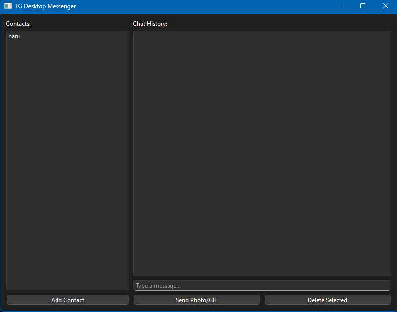

# TG Desktop Messenger

A desktop application (GUI) to manage Telegram chats via a Bot API. It allows you to send and receive messages/photos using a local contact list.



## ⚠️ Important Note
**Telegram API Limitation:** The bot can only send messages to users who have previously started a conversation with it (e.g., by clicking `/start` or sending a message). You **cannot** send messages to random users by ID if they haven't interacted with your bot first.

## Features
* **Contact Management:** Add users by their unique Telegram ID.
* **History:** Saves chat history locally in JSON files.
* **Media Support:** Send photos or GIFs.
* **UI:** Built with PySide6 (Qt) and integrated with `aiogram` via `qasync`.

## Installation
1. Create a `.env` file in this directory:
   ```env
   API_TOKEN=your_bot_api_token